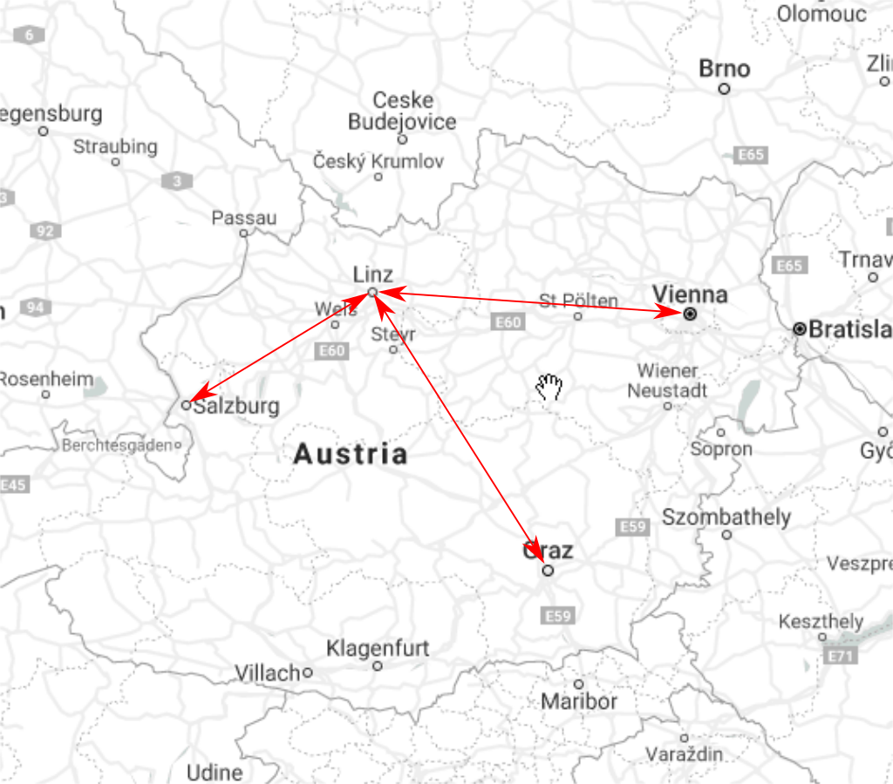

# Travel Planner

## Introduction

Your job is to write a HTTP Web API with which you can plan a bus trip between cities. The company in which you work offers bus services. All bus lines travel to/from different cities (Salzburg, Vienna, Graz) from/to a central hub in *Linz*. In Linz, passengers can optionally change to a different bus and travel to their final destination.



## Bus Schedule

The bus routes and their scheduled departure and arrival times can be read from [https://cddataexchange.blob.core.windows.net/data-exchange/htl-homework/travelPlan.json](https://cddataexchange.blob.core.windows.net/data-exchange/htl-homework/travelPlan.json). Assumption: The schedule is identical on every day of the year.

```json
[
    {
        "City": "Salzburg",
        "ToLinz": [
            { "Leave": "09:00", "Arrive": "10:45" },
            { "Leave": "11:00", "Arrive": "12:15" },
            { "Leave": "13:00", "Arrive": "14:15" },
            { "Leave": "15:00", "Arrive": "16:45" }
        ],
        "FromLinz": [
            { "Leave": "11:00", "Arrive": "12:15" },
            { "Leave": "12:30", "Arrive": "13:45" },
            { "Leave": "14:30", "Arrive": "16:00" },
            { "Leave": "17:00", "Arrive": "18:45" }
        ]
    },
    {
        "City": "Vienna",
        "ToLinz": [
            { "Leave": "08:00", "Arrive": "10:30" },
            { "Leave": "11:00", "Arrive": "13:15" },
            { "Leave": "14:00", "Arrive": "16:30" },
            { "Leave": "17:00", "Arrive": "19:15" }
        ],
        "FromLinz": [
            { "Leave": "11:00", "Arrive": "13:15" },
            { "Leave": "13:30", "Arrive": "15:45" },
            { "Leave": "16:45", "Arrive": "19:00" },
            { "Leave": "19:30", "Arrive": "21:45" }
        ]
    },
    {
        "City": "Graz",
        "ToLinz": [
            { "Leave": "06:00", "Arrive": "09:00" },
            { "Leave": "12:00", "Arrive": "15:00" },
            { "Leave": "16:00", "Arrive": "19:00" }
        ],
        "FromLinz": [
            { "Leave": "10:00", "Arrive": "13:00" },
            { "Leave": "15:30", "Arrive": "18:30" },
            { "Leave": "19:30", "Arrive": "22:30" }
        ]
    }
]
```

## Requirements

* Use *ASP.NET Core 3* and C#.

* You do *not* have to implement error handling. You can assume that the JSON file can be successfully read and that it contains meaningful values. You can assume that meaningful parameters are given (e.g. given city must exist in bus schedule JSON file). If not, it is ok if your app crashes with an unhandled exception.

* Put the business logic of finding bus routes in a reusable *.NET Standard 2.1* class library. The class library *must not* contain any input or output (e.g. sending HTTP requests, reading files, writing to console).

* Read the JSON content into appropriate in-memory data structures. It is up to you to decide which data structures make most sense.
  * **Tip:** You do not have to convert time values, you can process them *as strings* because all time values always follow the format *HH:MM* (24-hours schema)

* Your Web API receives a departure city, a destination city, and a start time as query parameters (e.g. *https://localhost:5001/api/travelPlan?from=Vienna&to=Linz&start=10:00*). Either the departure or the destination city will be *Linz* (earn extra points if you support looking for any city-to-city combination; see below for details). You have to find a suitable bus route from/to the given city to Linz. Examples:
  * *https://localhost:5001/api/travelPlan?from=Vienna&to=Linz&start=10:00* leads to *{ "depart": "Vienna", "departureTime": "11:00", "arrive": "Linz", "arrivalTime": "13:15" }*
  * *https://localhost:5001/api/travelPlan?from=Linz&to=Vienna&start=15:00* leads to *{ "depart": "Linz", "departureTime": "16:45", "arrive": "Vienna", "arrivalTime": "19:00" }*
  * *https://localhost:5001/api/travelPlan?from=Linz&to=Vienna&start=20:30* leads to HTTP status code *Not Found*

## Extra Points

Notify Mr. Stropek via GitHub issue if you think you have earned extra points.

Your Web API can find trips from any city to any city via *Linz*. If departure and destination city is not *Linz*, you have to look for a travel from departure city to *Linz* and then from *Linz* to destination city. Examples:

* *https://localhost:5001/api/travelPlan?from=Salzburg&to=Vienna&start=06:00* leads to *{ "depart": "Salzburg", "departureTime": "09:00", "arrive": "Vienna", "arrivalTime": "13:15" }*
* *https://localhost:5001/api/travelPlan?from=Vienna&to=Salzburg&start=08:00* leads to *{ "depart": "Vienna", "departureTime": "08:00", "arrive": "Salzburg", "arrivalTime": "12:15" }*
* *https://localhost:5001/api/travelPlan?from=Graz&to=Salzburg&start=16:00* leads to HTTP status code *Not Found*
